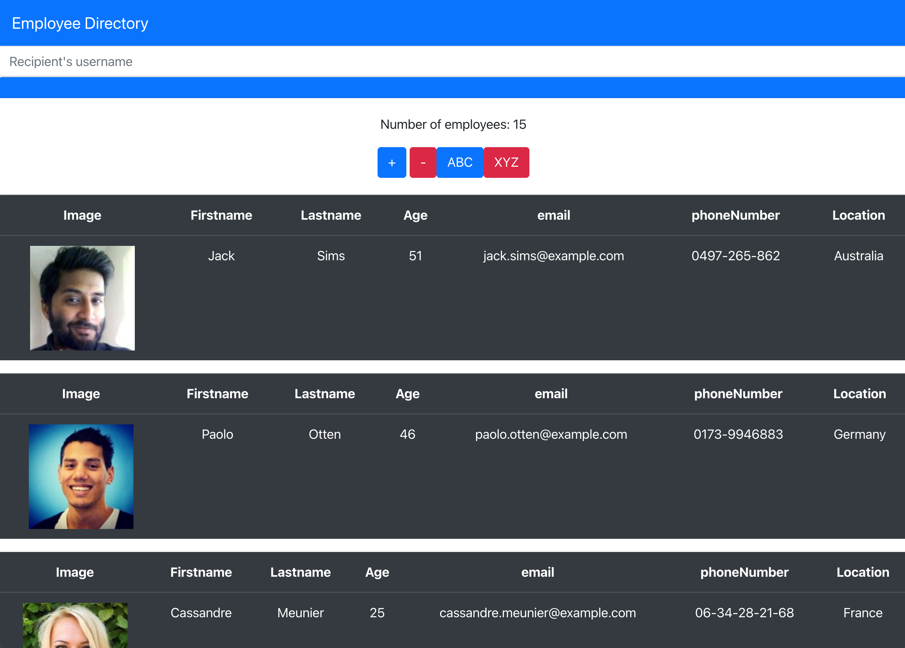

#  Employee Directory 

## Description

 a employee directory with React. Employee Director that you will be able to find a person with a searchbar also you will be able to show more or less users. 

 App: https://mf948.github.io/npx-employee-directory/

 Github: https://github.com/Mf948/npx-employee-directory

## Table of contents

[User Story ](#user)  
[Installation](#installation) 
[Technology used](#technology) 
[Deploying the App](#Deploying)
[License](#License)  

## User Story
* As a user, I want to be able to view my entire employee directory at once so that I have quick access to their information.

## technology used:
React.js Employee API
## Installation
no prior Intstallation required

## Deploying 
 not need to deploy app, use the link to run or git clone and happy coding
## Questions
 Contact me 
EMAIL: Xferreiramat@gmail.com
## License
Content in this project is governed under the MIT License.

To read the license in its entirety, click here: [MIT](./LICENSE)

---

Copyright [2021] [Mateo Ferreira]
